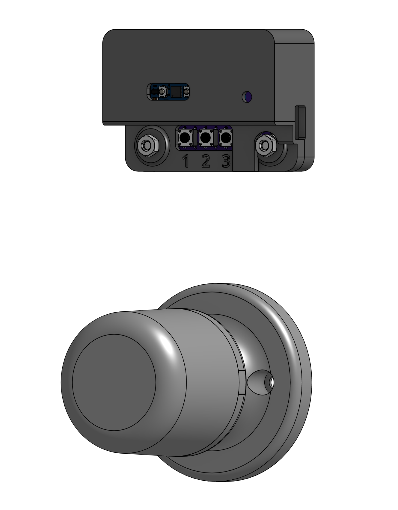

# Smart Door Knob

*A Matter compatible smart door knob*

## Overview
This smart door knob is designed specifically for Kwikset bed/room door knobs. The door knob is compatible with the [Matter](https://en.wikipedia.org/wiki/Matter_(standard)) smart home protocol, so it works with Amazon Alexa, Apple HomeKit, and Google Home. The only requirement is that you have a [Thread Border Router](https://www.matteralpha.com/explainer/thread-border-router) for the microcontroller (Arduino Nano Matter) to connect to.

## Instructions
After the code is flashed, you will need to set it up. You can use the QR Code link provided in the terminal, or use a manual pairing code. Once paired, (and whenever it turns on/resets after that) the RGB LED will begin to pulse blue. This signifies that it is in the process of connecting to the Thread Border Router that you specificed.

Once connected, the LED will turn off, indicating that the process has finished and that the door lock is ready to be controlled. You can then freely control the door lock either through your Matter smart home, or manually with the buttons. When the door is locked, the LED will be red, and when unlocked, the LED will be green. To unlock the door manually, enter the passcode specified in the code under the `buffer` variable (1-1-3-2 by default) using the corresponding buttons 1, 2, or 3. To lock the door manually, simply press any combination of incorrect buttons, and the door will lock if it wasn't locked already.

If you hit a wrong button and want to clear your input, simply wait for 5 seconds and all button input will be erased. If this is too long, the `inputWaitTime` variable can be customized in the code to change the clear time.

## Firmware Installation
Open the repo folder in Arduino IDE. If needed, pin numbers for components such as the RGB LED, servo, and buttons can be changed manually in the Arduino code file. Flash the code onto the Arduino Nano Matter. Once done, in the Serial Monitor (115200 baud), information for pairing the door lock can be found and used with a Matter compatible device.

## BOM
- 1x [Arduino Nano Matter with headers](https://store-usa.arduino.cc/collections/internet-of-things/products/nano-matter) (or [similar board](https://github.com/SiliconLabs/arduino/blob/main/readme.md))

- 2x 1x15 Socket Headers

- 1x [MG90 Servo](https://www.amazon.com/MG90S-Servo-Motor-Helicopter-Arduino/dp/B07L6FZVT1?crid=VYZSRM9027BT) (SG90 also works)

- 3x [6mm Push Buttons](https://www.amazon.com/DAOKI-Miniature-Momentary-Tactile-Quality/dp/B01CGMP9GY?crid=3P0EFZBRL88C4&)

- 1x [Micro USB Connector](https://www.mouser.com/ProductDetail/Amphenol-FCI/10118194-0011LF?qs=9lcNTSmDlCqQOdqcAswPOg%3D%3D)

- 1x [RGB LED](https://www.amazon.com/EDGELEC-Tri-Color-Multicolor-Diffused-Resistors/dp/B077XGF3YR?crid=3S7KMO6E8I0PC)

- 1x [PCB Board](pcb/)

- 8x M3x12mm screws

- 7x [Custom 3D-printed parts](cad/printed)

- 6x M3 nuts